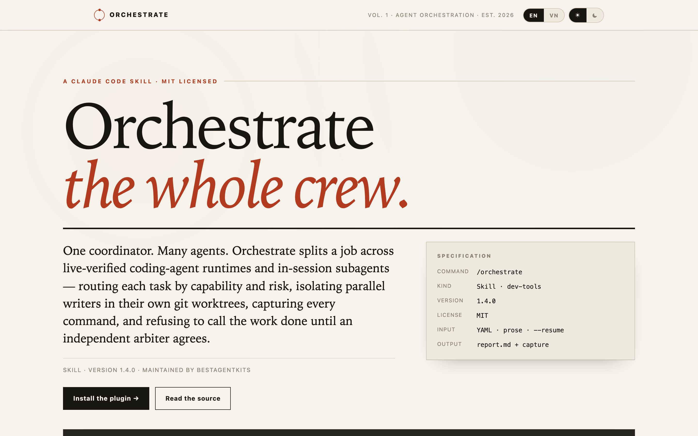

<div align="center">

# Orchestrate

**Multi-runtime agent orchestration for any coding-agent harness.**

An Agent Skills package: it runs on any harness that implements that contract, with
Claude Code as one supported harness among many. The
[harness portability contract](plugins/orchestrate/skills/orchestrate/references/harness-portability.md)
owns the conformance surface and the per-harness install and discovery paths.

Coordinate staged or parallel jobs across live-verified coding-agent runtimes,
coding-agent sessions and in-session subagents — routed by capability and risk,
isolated in git worktrees, fully captured, resumable, and blocked from
declaring success until deterministic checks pass and, for anything above
read-only or scoped-write work, an independent arbiter agrees.

[**Live site →**](https://sites.agentwiki.cc/s/rDUlzFFGwTCGPT0jo59FB/) ·
[Skill contract](plugins/orchestrate/skills/orchestrate/SKILL.md) ·
[Install](#install) ·
[MIT](LICENSE)

</div>

[](https://sites.agentwiki.cc/s/rDUlzFFGwTCGPT0jo59FB/)

---

## Why

Fanning work out to several agents takes one loop. What it costs you is everything
that makes the result believable: two agents editing the same file, a runtime that
silently vanished, a model name that stopped existing last week, a permission prompt
swallowed by a headless process, and a cheerful summary claiming success nobody verified.

Orchestrate treats those as the actual problem:

- **Every route is resolved from live evidence** at execution time — never from a
  catalog written into a file. Runtimes, models, aliases, flags and agents are all
  re-probed per run.
- **Every parallel writer gets its own git worktree**, branched from the accepted base ref.
- **Every job records** its redacted command, bounded stdout/stderr, exit status, wall
  time and artifacts under one run directory.
- **Nothing is reported finished** until it clears verification. Deterministic
  checks run first; then an escalation gate decides whether a C3 arbiter is
  required. An attempt may be accepted without a C3 call only when its recorded
  tier is R0/R1 with no risk-floor raise, a valid per-classifier calibration
  record exists, and every other gate condition holds. **R2, R3 and all judgment
  work always go to an independent C3 route.** When no independent route exists,
  the verdict is labeled `not-independent` and the job is blocked unless a fresh,
  independently configured context substitutes for it.

## Pipeline

| # | Stage | What it guarantees |
|---|-------|--------------------|
| 1 | Brainstorm & intake | Outcome, constraints and acceptance evidence are explicit. Secrets are refused at the door. If orchestration adds nothing, it says so. |
| 2 | Build the job graph | Jobs carry explicit `task`, `cwd`, timeout, expected output and file ownership. `depends_on` forms the stages. |
| 3 | Discover, profile, route, optimize | Live runtime inventory → profile → deterministic capability/risk filter → optional System-1 semantic rank (may only raise a floor) → graph optimizer. Recorded with its evidence source. A pinned runtime that is missing is onboarded as a visible setup step. |
| 4 | Apply the safety gate | Least privilege, permission bypass off, destructive/credentialed work needs approval for that exact scope. The tier is derived deterministically from declared attributes, and an absent tier fails closed to R2. |
| 5 | Dispatch, observe, verify | Worktrees created before dispatch, `state.json` updated on every transition, output bounded and redacted, normalized events, every attempt observed until settled. |
| 6 | Verify and review | Deterministic checks first. Then the escalation gate: R0/R1 with a valid per-classifier calibration record may be accepted; R2 above that, and all judgment work, go to an independent C3 route. |
| 7 | Report | One `report.md` with statuses, resolved routes, artifacts, verdict, repro commands and unresolved questions. |

## Routing

Two independent axes. A job runs only where **both** floors are met — otherwise it is
marked `blocked`, never quietly downgraded.

**Capability**

| Tier | Required behavior | Typical work |
|---|---|---|
| `C1` throughput | Accurate search, extraction, summarization, bounded repetitive changes | scout, docs, mechanical fan-out |
| `C2` delivery | Multi-file implementation judgment, test design, failure-path handling | normal implementation and tests |
| `C3` judgment | Deep trade-off analysis, conflict resolution, security reasoning, independent arbitration | architecture, review, audit, arbiter |

**Risk**

| Tier | Effect | Minimum controls |
|---|---|---|
| `R0` observe | Read/report only | Explicit cwd, bounded timeout, captured result, no unnecessary write or shell grant |
| `R1` scoped write | Reversible edits in owned files | Scoped write boundary, tool restrictions, diff capture, no permission bypass |
| `R2` isolated write | Parallel, high-impact, untrusted, or hard-to-revert changes | Separate worktree **or stronger isolation**, enforced sandbox where available, **explicit checks and arbiter review** |
| `R3` external/destructive | Deploy, release, delete, credentialed, or other external side effect | Explicit user approval, preview/rollback plan, **strongest verified controls**; blocked when those controls are unavailable |

Risk tiers are defined once, in
[`safety-policy.md`](plugins/orchestrate/skills/orchestrate/references/safety-policy.md);
the tables above summarize and link, they do not own the policy.

### The System-1 decision plane (optional)

Routing is deterministic. An optional, provider-neutral **decision plane** can
supply scored signals on top of it — how likely a trace is stalled, which
failure class an error belongs to, which capability a job actually needs — but
it never decides:

- It is sourced from a runtime **already in the live inventory**; there is no new
  provider dependency and no new credential system. Jev (TypeSafe) is the reference
  implementation and one optional provider. The plane reads the runtime's own
  provider credential from a documented resolution order; configure nothing and the
  plane is **disabled**, not silently re-routed.
- Its `floor_delta` splits into `capabilityFloorDelta` and `riskFloorDelta`. Both
  may only **raise** a floor, and a lowering signal is discarded. A risk-floor
  raise changes the recorded tier, adds controls, and always escalates to C3 — so
  a probabilistic signal can shrink the no-C3 path, never widen it.
- It never grants a permission, assigns a risk tier, emits a command, mutates
  shared state, weakens review independence, or replaces the C3 arbiter.
- With no eligible classifier it is **disabled** and deterministic policy decides.

Details: [`decision-plane.md`](plugins/orchestrate/skills/orchestrate/references/decision-plane.md).

### Benchmark-ranked routing

Routing ranks the candidates that already survived the hard filter, using measured
success rate, cost per task and task duration for a model at a given reasoning effort.
That evidence is fetched from named sources and cached **between runs** at
`.orchestrate/benchmarks.json` for a configurable period. Benchmarks **rank, never
gate**: they cannot set eligibility, a floor, a tier, a control or an approval. The
cache TTL defaults to seven days, and a job may not declare more than thirty.
See [references/benchmark-evidence.md](plugins/orchestrate/skills/orchestrate/references/benchmark-evidence.md).

### Promotion and fail-safe

A quota limit, an outage or a crash promotes the job to the next candidate — after the
same-runtime retry budget is exhausted, and honoring a declared `fallback_runtime` order
first — within a bounded budget that ends in a logged `blocked` state. A **failed check
never promotes**, and a **permission or authorization stop never promotes**. Two
promotions by default, four at most. See
[references/fallback-policy.md](plugins/orchestrate/skills/orchestrate/references/fallback-policy.md).

### Trace and logs

Every routing decision, promotion, gate outcome and verdict carries one correlation
identity, and the trace records fetch attempts as well as decisions. It is redacted on
write and excluded from exports unless reviewed, and a run whose trace is incomplete
must say so rather than implying a complete audit trail. See
[references/trace-and-logging.md](plugins/orchestrate/skills/orchestrate/references/trace-and-logging.md).

### Credentials

The provider key is read from the process environment, then the project `.env`, then the
`skills/` directory `.env`, then the skill's own `.env`; the first location with a value
wins. The value is passed **only** through the inherited child environment, and a
shadowed source is reported. The key is never printed, never requested interactively and
never committed — a missing key disables the decision plane instead. This section is a
**parity-checked summary** of
[references/decision-plane.md](plugins/orchestrate/skills/orchestrate/references/decision-plane.md),
which owns the order.

## Install

### With the skills CLI

```bash
npx skills add bestagentkits/orchestrate
```

```bash
npx skills add bestagentkits/orchestrate -g            # install for the current user
npx skills add bestagentkits/orchestrate -a <harness>  # install for one named harness
```

The Claude Code marketplace install and the plain-skill copy below are both unchanged
and still supported: the CLI is an additional path, not a replacement.

### As a Claude Code plugin (one harness among many)

```bash
/plugin marketplace add bestagentkits/orchestrate
```

```bash
/plugin install orchestrate@orchestrate
```

Restart Claude Code so the skill registers.

### As a plain skill

No plugin system required — copy the skill folder into your project or your home config.
The destination depends on the harness; `.claude/skills/` is only the Claude Code
convention, and [the portability contract](plugins/orchestrate/skills/orchestrate/references/harness-portability.md)
lists the others:

```bash
git clone https://github.com/bestagentkits/orchestrate.git
cp -R orchestrate/plugins/orchestrate/skills/orchestrate ~/.claude/skills/   # Claude Code
# other harnesses read their own path, for example ~/.agents/skills/ or ~/.pi/skills/
```

## Usage

```bash
/orchestrate "research three caching strategies and compare them"
```

```bash
/orchestrate "refactor the session API" --internal
```

```bash
/orchestrate plans/jobs.yaml --yes
```

```bash
/orchestrate --resume plans/reports/orchestrate-<timestamp>
```

`--internal` is a routing *preference*, not a hard mode: it asks the selection policy
to consider in-session subagents first for jobs without an explicit `runtime:`.
`--yes` pre-approves the exact destructive scope described in the spec.

### Job spec

```yaml
version: 1
concurrency: 2
jobs:
  - id: scout-session-api
    runtime: internal
    task: scout
    cwd: <workspace-root>
    prompt: "Inspect the session API and report extension points."
    timeout: 10m
    expected_output: "Markdown report with files read and recommended seams."

  - id: independent-review
    runtime: <verified-cli-runtime>
    fallback_runtime: [<verified-fallback-runtime>]
    task: review
    depends_on: [scout-session-api]
    importance: high
    isolation: worktree
    timeout: 10m
    expected_output: "Independent verdict with checks and unresolved risks."
```

Placeholders are deliberate. They are resolved and recorded from live evidence during
the run — never filled in from memory. See
[`job-spec.md`](plugins/orchestrate/skills/orchestrate/references/job-spec.md) for the
full schema.

### Output layout

This block is a summary of the [normative tree](plugins/orchestrate/skills/orchestrate/references/output-layout.md),
which owns the layout.

```text
plans/reports/orchestrate-<timestamp>/
  jobs.yaml            # private resolved input; do not export wholesale
  state.json           # authoritative attempts and acceptance fingerprints
  metrics.jsonl        # per-attempt observed outcomes
  runtimes.json        # current discovery and control evidence
  decisions.jsonl      # enumerated decision traces; exclude unless reviewed
  calibration.json     # per-classifier threshold, sample count and expiry
  trace.jsonl          # the correlated record; redacted on write
  report.md            # checks, arbiter verdict, integration; carries traceStatus
  worktrees/<job-id>/
  supervisor/<supervisor-run-id>/
    events.jsonl
    graph.json
    output-<job-id>.log
  <job-id>/
    command.txt          # CLI jobs
    stdout.txt           # CLI jobs
    stderr.txt           # CLI jobs
    result.md            # internal and native jobs
    session.json         # Pi jobs
    status.json
    native-<attempt-id>.json
    artifacts/
    attempt-<n>/
```

The tree above is a summary. [`output-layout.md`](plugins/orchestrate/skills/orchestrate/references/output-layout.md)
owns the run-directory and supervisor contract, and
[`job-spec.md`](plugins/orchestrate/skills/orchestrate/references/job-spec.md)
owns the per-job capture contract.

## Reference files

The skill keeps each durable contract in exactly one place, and it says which
one owns what:

| File | Owns |
|---|---|
| [`SKILL.md`](plugins/orchestrate/skills/orchestrate/SKILL.md) | The pipeline, dispatch, safety gate, limitations |
| [`runtime-adapter-contract.md`](plugins/orchestrate/skills/orchestrate/references/runtime-adapter-contract.md) | The adapter interface, conformance, command construction, OS revalidation |
| [`runtime-profile.md`](plugins/orchestrate/skills/orchestrate/references/runtime-profile.md) | Candidate discovery (including the classifier role), probing, `runtimes.json`, support states, timeouts, auto-profiler |
| [`event-protocol.md`](plugins/orchestrate/skills/orchestrate/references/event-protocol.md) | Normalized event envelope and kinds, cursor semantics, agent state machine, redaction and provenance |
| [`safety-policy.md`](plugins/orchestrate/skills/orchestrate/references/safety-policy.md) | **Sole safety authority**: risk tiers R0–R3, minimum controls, approval and authority, isolation, secrets, and what no signal may decide |
| [`routing-policy.md`](plugins/orchestrate/skills/orchestrate/references/routing-policy.md) | **Sole route-selection authority**: hard filter, capability tiers, task floors, floor-raising, ranking, fallbacks, reasoning controls |
| [`decision-plane.md`](plugins/orchestrate/skills/orchestrate/references/decision-plane.md) | The System-1 contract, provider sourcing, six decision tasks, the decision trace, and its non-authority |
| [`harness-portability.md`](plugins/orchestrate/skills/orchestrate/references/harness-portability.md) | The Agent Skills conformance surface, the forbidden harness dependencies, and every install and discovery path |
| [`benchmark-evidence.md`](plugins/orchestrate/skills/orchestrate/references/benchmark-evidence.md) | Measured outcome evidence, its sources, the durable cross-run cache, and what it may never decide |
| [`fallback-policy.md`](plugins/orchestrate/skills/orchestrate/references/fallback-policy.md) | The promotion chain, its triggers and budget, the per-concern control comparison, and the terminal fail-safe |
| [`trace-and-logging.md`](plugins/orchestrate/skills/orchestrate/references/trace-and-logging.md) | Span identifiers, the correlation rule, retention and export |
| [`verification.md`](plugins/orchestrate/skills/orchestrate/references/verification.md) | The three verification layers, the **escalation matrix**, calibration, arbiter contract, presentation parity |
| [`graph-optimizer.md`](plugins/orchestrate/skills/orchestrate/references/graph-optimizer.md) | Graph reduction, merge algebra, refusal conditions, resume semantics |
| [`internal-routing.md`](plugins/orchestrate/skills/orchestrate/references/internal-routing.md) | The internal adapter: in-session dispatch, capture, timeout, resume, agent resolution |
| [`job-spec.md`](plugins/orchestrate/skills/orchestrate/references/job-spec.md) | YAML schema, run-state and resume contract, capture contract, machine fields |
| [`observation.md`](plugins/orchestrate/skills/orchestrate/references/observation.md) | Incremental observation, watchdog handoff, intervention, diagnosis |
| [`failure-modes.md`](plugins/orchestrate/skills/orchestrate/references/failure-modes.md) | Hard stops for failure, timeout, permission, interruption, ownership |
| [`dispatch-hardening.md`](plugins/orchestrate/skills/orchestrate/references/dispatch-hardening.md) | Long, detached and network-dependent job mechanics on sandboxed hosts |
| [`output-layout.md`](plugins/orchestrate/skills/orchestrate/references/output-layout.md) | Run-directory and supervisor capture tree, decision artifacts, export rules |
| [`metrics-and-self-improvement.md`](plugins/orchestrate/skills/orchestrate/references/metrics-and-self-improvement.md) | Run comparison, arbiter-gate telemetry, calibration inputs |
| [`runtimes/README.md`](plugins/orchestrate/skills/orchestrate/runtimes/README.md) | The adapter index, the authoring procedure, and the per-runtime probe targets |
| [`runtimes/pi.md`](plugins/orchestrate/skills/orchestrate/runtimes/pi.md) · [`pi-onboarding.md`](plugins/orchestrate/skills/orchestrate/runtimes/pi-onboarding.md) | Pi session/dispatch contract and Pi install/auth/projection. A full note written from an authoring-time smoke run — not a live probe for your host, which every run still requires |
| [`runtimes/`](plugins/orchestrate/skills/orchestrate/runtimes) — `omp`, `agy`, `grok`, `claude`, `codex`, `gemini`, `opencode`, `aider` | Adapter index. `omp`, `agy` and `grok` are documented probe targets; `claude`, `codex`, `gemini`, `opencode` and `aider` are fenced **unverified stubs**. None of the eight is a support claim, and none is in any inventory until a probe is recorded |

## Upgrading

### From 2.1.0 to 2.2.0

An **additive** release — 2.2.0 removes no file and changes no path. The `/orchestrate`
command, its arguments and the `jobs.yaml` schema are unchanged, so an existing spec
still validates. Four reference documents are added, `.gitignore` gains dotenv and
cache rules, and five visible behaviours change.

What you will notice:

- **It installs through the skills CLI.** `npx skills add bestagentkits/orchestrate`
  installs the payload on any harness that implements Agent Skills. The Claude Code
  marketplace install and the plain-skill copy both still work; the skill is no longer
  documented as Claude-Code-only.
- **Routing is ranked by benchmark evidence.** Candidates that already passed the hard
  filter are ordered by measured success rate, cost per task and task duration at a
  given reasoning effort, and that evidence is cached **between runs** at
  `.orchestrate/benchmarks.json`.
- **Infrastructure failures promote.** A quota limit, an outage or a crash moves the
  job to the next candidate, after the same-runtime retry budget and honouring a
  declared `fallback_runtime` order first, within a bounded budget that ends in a
  logged `blocked` state.
- **Credentials resolve from four documented locations** — process environment, project
  `.env`, the `skills/` directory `.env`, then the skill's own `.env` — and the value is
  passed only through the inherited child environment, never as an argument or in a
  prompt.
- **The trace gains span identifiers**, so operations inside one attempt are
  distinguishable and a promoted attempt is distinguishable from a retry.

Two rules got stricter, and both are worth knowing before you rely on the new paths:

- Benchmark evidence **cannot** change eligibility, a floor, a tier, a control or an
  approval. It ranks candidates; it never gates them.
- A **failed check never promotes**, and neither does a permission or authorization
  stop. Promoting past either would be retrying until the check passes.

New reference documents:

- [`references/harness-portability.md`](plugins/orchestrate/skills/orchestrate/references/harness-portability.md)
- [`references/benchmark-evidence.md`](plugins/orchestrate/skills/orchestrate/references/benchmark-evidence.md)
- [`references/fallback-policy.md`](plugins/orchestrate/skills/orchestrate/references/fallback-policy.md)
- [`references/trace-and-logging.md`](plugins/orchestrate/skills/orchestrate/references/trace-and-logging.md)

New in 2.2.0, owner-fixed constants:

- Cache TTL: `CACHE_TTL_DEFAULT_HOURS` = 168 (seven days), `CACHE_TTL_MAX_HOURS` = 720
  (thirty days).
- Promotion budget: `MAX_PROMOTIONS_DEFAULT` = 2, `MAX_PROMOTIONS_MAX` = 4.

Also fixed in 2.2.0: a corrupted sentence in `routing-policy.md` that read "its the
floor deltas have already raised floors". It was found while rewriting that step and
corrected in place.

### From 1.8.x to 2.0.0 — breaking

**This release is breaking for anyone who linked to or bookmarked the old
reference files.** Six paths stop existing and two of them are renamed rather
than deleted, so a stale link may resolve to nothing or to a different contract
than the reader expects. There are no redirect stubs, deliberately: a stub would
create a second place a contract appears to live, which is the defect this
release exists to remove.

| 1.8.x path | 2.0.0 status | Destination |
|---|---|---|
| `references/model-routing.md` | **deleted** | Split: `routing-policy.md` (deterministic selection) and `decision-plane.md` (semantic signals) |
| `references/runtime-matrix.md` | **deleted** | Merged into `runtime-profile.md` and `runtime-adapter-contract.md` |
| `references/harness-profiles.md` | **deleted** | Merged into `runtime-profile.md` and `safety-policy.md` |
| `references/arbiter-checklist.md` | **deleted** | Absorbed into `verification.md` |
| `references/pi-sessions.md` | **renamed and moved** | `runtimes/pi.md` |
| `references/pi-onboarding.md` | **renamed and moved** | `runtimes/pi-onboarding.md` |

If you maintain automation that reads these files, update the paths. If you only
invoke `/orchestrate`, nothing is required.

What else changed:

- **Routing is now explicitly two-stage.** A deterministic hard filter decides
  eligibility and floors; an optional provider-neutral System-1 plane supplies
  scored signals that may only *raise* a floor. Safety authority did not move: it
  is consolidated in `safety-policy.md`.
- **Acceptance is now tiered and explicit.** A no-C3 acceptance requires an
  attempt whose recorded tier is R0/R1, no risk-floor raise, a valid
  per-classifier calibration record meeting owner-fixed floors, and every other
  gate condition. R2, R3, any verdict job, and any tier raised by a semantic
  signal always escalate. Acceptance is recorded per attempt, and the report
  states the accepted-without-C3 count.
- **Observation is normalized.** Every runtime's output is translated into one
  event protocol, so a new runtime adds an adapter rather than a branch in every
  consumer.
- **Runtime notes moved out of core.** Pi is no longer privileged in the skill's
owner–contract map; it is an adapter note like any other.

The skill name, the `/orchestrate` command, and the `--yes`, `--internal` and
`--resume` arguments are unchanged.

### From 2.0.0 to 2.1.0

A defect-fix release that closes two holes in the acceptance gate and tightens
several allowances. No file path changes, and the `/orchestrate` command, its
arguments and the `jobs.yaml` schema are unchanged, so an existing spec still
validates. It is a minor rather than a patch release because two things a reader or
a tool may depend on did change: `state.json` records acceptance per attempt, and
a job whose risk floor a semantic signal raises now escalates to C3.

If you invoke `/orchestrate`, every change below only makes the gate stricter:

- **A risk-floor raise now reaches the field the gate reads.** The semantic
  router's adjustment is recorded as two separate deltas,
  `capabilityFloorDelta` and `riskFloorDelta`. The recorded `riskTier` is
  `max(tierDerivation, riskFloorDelta)`, and any attempt carrying a non-zero
  `riskFloorDelta` always escalates to C3. Previously a raise could leave
  `riskTier` reading R1 while `routing-policy.md` treated the job as R2, so the
  acceptance gate read a weaker tier than the router acted on.
- **Calibration can no longer be satisfied by an empty record.** The micro-arbiter
  path requires at least 30 comparable C3-audited outcomes, measured agreement of
  at least 0.95, a threshold of at least 0.90, and a record covering all three
  signals. Those are policy constants owned by `verification.md`, so a job spec can
  no longer set its own bar; a missing or lower `calibration.minimum_samples`
  disables the no-C3 path instead of lowering it.
- **Signal direction is explicit.** `artifact_matches_expected_output` and
  `claims_supported_by_evidence` must be `>= threshold`;
  `materially_unresolved` must be `< threshold`.
- **Review verdicts always escalate.** `review`, and any job whose artifact is a
  verdict on another job's work, escalated only by convention before; they are now
  in the always-escalate list.
- **Permission bypasses are never enabled.** The exception that permitted a bypass
  with approval is removed. A job needing more privilege gets scoped permissions,
  a stronger external boundary, or `blocked`.
- **Review independence is binding.** With no different-family route, the verdict
  is labeled `not-independent` and the job is blocked unless a fresh,
  independently configured context substitutes.
- **The decision plane may not authorize its own egress.** Sending prompts or
  repository context to a provider requires a recorded user-authorization scope;
  with none, the plane is disabled for the run.
- **Acceptance is recorded per attempt.** `state.json` gains `attemptRecords[]` and
  the job-level fields become aggregates, because calibration needs the
  per-attempt pairing. The job-level `floorDelta` is replaced by the per-attempt
  `capabilityFloorDelta` and `riskFloorDelta`, which are recorded separately
  because only the risk delta changes the tier and forces a C3 call. Each attempt
  also records the `model` it resolved and the reasoning effort it ran at
  (`effortLevel`, `effortRaw`), so a promoted attempt's values never overwrite its
  predecessor's.

### From 1.4.x to 1.8.0

- **Metrics moved into the run.** 1.4.x appended to
  `plans/reports/orchestrate-history.jsonl`. 1.8.0 writes a per-attempt
  `metrics.jsonl` inside each run directory and aggregates only comparable
  records when comparing runs. An existing history file is left in place and is
  simply no longer written to.
- **Agent sessions joined the runtime set.** Pi sessions became a first-class job
  target with their own probing, dispatch, capture and onboarding references.
- **Observation and intervention became explicit.** A run declares what liveness,
  activity and accepted progress mean for each job, instead of treating a quiet
  process as finished work.

## Maintaining the docs

This repository ships no code and no `package.json`, so there is no committed
linter: a doc-integrity script would be its first executable, would sit outside
the published plugin payload, and would contradict the rule in
`dispatch-hardening.md` that bundled scripts resolve skill-relative rather than
from the repo root. Containment here is therefore **normative, not mechanical** —
and this section exists so that any maintainer can *re-run* it rather than trust
it.

The one workflow under `.github/workflows/` publishes `site/` to GitHub Pages. It
runs no check and gates nothing: a documentation change is still verified by the
sweep below, by a maintainer.

Run the whole sweep before merging a change to this reference set. Every command
below is copy-pasteable, and the controls in step 2 verify that the checks
themselves work.

The flow figure on the landing page is a **compiled copy**. Its sources are
`site/flow/routing.json` and `site/flow/review.json`, typed diagram IR in the format the
`ak:diagram` skill consumes; each is compiled with
`node scripts/compiler/compile.mjs --input <ir> --format svg --preset editorial --theme light`
and the result is inlined with its `aria-label` replaced by `aria-labelledby`. The
repository carries no compiler, so the sweep asserts the panels' declared envelope against
the IR and not their geometry: a changed IR that is not recompiled is caught, a correct
recompilation is not re-derived.

Two limits are worth stating before anyone trusts a green run. The **no copied measurement**
rule — that no benchmark value, model name, flag or leaderboard row is pasted into the
skill — is a **review item a grep cannot enforce**, because any token check would have to
name the token it forbids. And a grep proves a token *exists*, not that a rule *holds*: a
passing sweep is not evidence that no benchmark value was copied, only that the checks
below found nothing.

```bash
# 1. DENYLIST — no link to a deleted reference, and not to the old Pi location.
#    The alternation lives in a variable so this block cannot match itself.
refs='model-routing|runtime-matrix|harness-profiles|arbiter-checklist|pi-sessions'
grep -rnE "\]\([^)]*($refs)\.md\)" --include='*.md' . | grep -v '^\./plans/'
grep -rnE "\]\([^)]*references/pi-onboarding\.md\)" --include='*.md' . | grep -v '^\./plans/'
#    Both must print nothing.

# 2. CONTROLS — prove the denylist can catch a stale link and does not misfire.
#    The probe is assembled from parts so this block cannot match itself.
printf 'x [a](references/%s.md)\n' 'model-routing' > /tmp/stale.md
grep -qE "\]\([^)]*($refs)\.md\)" /tmp/stale.md && echo "control OK: stale caught" || echo "CONTROL FAILED"
printf 'x [a](runtimes/pi-%s.md)\n' 'onboarding' > /tmp/valid.md
grep -qE "\]\([^)]*references/pi-onboarding\.md\)" /tmp/valid.md && echo "CONTROL FAILED: valid flagged" || echo "control OK: valid relocated path not flagged"
rm -f /tmp/stale.md /tmp/valid.md

# 3. VERSION — exact surface counts, not merely "present", and no replaced version
#    left behind. 2.1.0 is the version this release replaces, so it is denied too.
test "$(grep -c '2\.2\.0' plugins/orchestrate/.claude-plugin/plugin.json)" = 1 || echo "FAIL plugin.json"
test "$(grep -c '2\.2\.0' plugins/orchestrate/skills/orchestrate/SKILL.md)" = 1 || echo "FAIL SKILL.md"
test "$(grep -c '2\.2\.0' site/index.html)" = 3 || echo "FAIL site (byline, spec table, vi i18n byline)"
#    AGENTS.md is a reader surface this release created, so it is swept too.
#    README.md is exempt: it keeps the historical upgrade sections, which name
#    1.8.x, 2.0.0, 2.0.1, 2.1.0 and 2.2.0 by design.
grep -rn '2\.0\.0\|2\.0\.1\|2\.1\.0\|1\.8\.0' plugins site .claude-plugin AGENTS.md \
  --include='*.json' --include='*.md' --include='*.html' && echo "FAIL stale version" || echo "version clean"

# 4. REACHABILITY — every reference and adapter note is linked by a peer,
#    whether the link is bare or path-qualified. A file must not count itself.
for f in plugins/orchestrate/skills/orchestrate/references/*.md \
         plugins/orchestrate/skills/orchestrate/runtimes/*.md; do
  b=$(basename "$f")
  grep -rqE "\]\([^)]*/?$b\)" --include='*.md' --exclude="$b" \
    plugins/orchestrate/skills/orchestrate README.md || echo "UNREACHABLE $b"
done

# 5. BOUNDARY — the accept predicate has exactly one owner, and a second owner must
#    fail rather than merely print an extra line a human might not read.
test "$(grep -rl 'Accept without a C3 call' plugins/orchestrate/skills/orchestrate/references | wc -l)" = 1 \
  || echo "FAIL: the accept predicate has more than one owner"
test "$(grep -rl 'Accept without a C3 call' plugins/orchestrate/skills/orchestrate/references)" \
  = plugins/orchestrate/skills/orchestrate/references/verification.md \
  || echo "FAIL: the accept predicate is not owned by verification.md"
#    Must print nothing.

# 6. PARITY — reader-facing surfaces must not state a weaker control for ANY tier.
#    These clauses must survive every summary, per tier.
check() { grep -qF "$2" "$1" || echo "PARITY FAIL $1 missing: $2"; }
for f in README.md site/index.html; do
  check "$f" "no unnecessary write or shell grant"   # R0
  check "$f" "no permission bypass"                  # R1
  check "$f" "explicit checks and arbiter review"    # R2
  check "$f" "strongest verified controls"           # R3
done
#    Must print nothing.

# 7. STUBS — unverified adapters stay unmistakably non-normative.
#    A loop rather than `grep -L`, whose exit status is not a pass/fail signal:
#    GNU grep returns 0 when files are listed, so a wrapper would read the opposite
#
#    result. The loop fails loudly on a missing banner instead.
for f in plugins/orchestrate/skills/orchestrate/runtimes/{claude,codex,gemini,opencode,aider}.md; do
  grep -q 'Status: unverified — not a support claim, not in inventory' "$f" \
    || echo "STUB FAIL $f"
done
#    Must print nothing.

# 8. SITE I18N — every data-i18n key in the markup has a Vietnamese entry, so a
#    new section cannot ship as English-only. The control proves the check fails.
for k in $(grep -o 'data-i18n="[^"]*"' site/index.html | cut -d'"' -f2 | sort -u); do
  grep -qE "(^|[ ,{]) *$k:" site/index.html || echo "I18N FAIL no VI entry: $k"
done
grep -qE '(^|[ ,{]) *noSuchKey:' site/index.html && echo "CONTROL FAILED" || echo "control OK: absent key detected"

# --- Steps added by 2.2.0 -------------------------------------------------
S=plugins/orchestrate/skills/orchestrate/references

# 9. NEW REFERENCES — each exists AND is reachable from a PEER document, not only
#    from SKILL.md's index row. The index row alone survives a broken cross-reference.
for b in harness-portability.md benchmark-evidence.md fallback-policy.md trace-and-logging.md; do
  test -f "$S/$b" || echo "MISSING $b"
  grep -rqE "\]\([^)]*/?$b\)" --include='*.md' --exclude="$b" --exclude='SKILL.md' \
    plugins/orchestrate/skills/orchestrate README.md || echo "NO PEER LINK for $b"
done
#    Must print nothing. SKILL.md is excluded above: its index row alone satisfies the
#    search, and an index row surviving a broken cross-reference is the one failure
#    this check exists to catch.

# 10. PORTABILITY — the payload may never depend on a Claude-Code-only feature, and
#     the one document REQUIRED to name them is excluded from the sweep.
#     --exclude, not `grep -v`: a `grep -v` on path:line output also drops any line
#     whose CONTENT names the excluded file, so a real violation annotated
#     "see harness-portability.md" would have read as clean.
grep -rn --exclude='harness-portability.md' 'context: fork\|^hooks:\|^allowed-tools:' \
  plugins/orchestrate/skills/orchestrate || echo "portability clean"
for f in "$S/harness-portability.md" README.md site/index.html; do
  grep -q 'npx skills add bestagentkits/orchestrate' "$f" || echo "CLI PATH MISSING in $f"
done

# 11. NEGATIVE SAFETY RULES — the two rules the release adds must be findable in
#     the file that owns each.
grep -q 'may not set eligibility' "$S/routing-policy.md" || echo "FAIL: benchmarks may gate"
grep -q 'failed check never promotes' "$S/fallback-policy.md" || echo "FAIL: check may promote"
grep -q 'authorization or permission failure never promotes' "$S/fallback-policy.md" || echo "FAIL: permission may promote"
#    The reader surfaces state both rules too, and most readers meet them there first.
grep -q 'cannot set eligibility, a floor, a tier, a control or an approval' README.md \
  || echo "FAIL: benchmark-never-gates rule missing from README"
grep -q 'failed check never promotes' README.md \
  || echo "FAIL: check-may-promote rule missing from README"
#    Must print nothing.

# 12. CREDENTIALS — the four paths live in one owner, in order, and nowhere else;
#     dotenv files stay untracked.
#    Anchored to the ordered list, so prose that also mentions a location cannot
#    inflate the count: only the four numbered locations are compared.
paths=$(grep -nE '^[0-9]+\. (the process environment|the project `\.env`|the `skills/` directory|the skill.s own `\.env`)' "$S/decision-plane.md")
test "$(printf '%s\n' "$paths" | wc -l)" = 4 || echo "FAIL: the credential order is not four locations"
#    Order, asserted by the numbering: location N must be the Nth documented location.
test "$(grep -cE '^1\. the process environment' "$S/decision-plane.md")" = 1 \
  || echo "FAIL: credential location 1 is not the process environment"
test "$(grep -cE '^2\. the project `\.env`' "$S/decision-plane.md")" = 1 \
  || echo "FAIL: credential location 2 is not the project .env"
test "$(grep -cE '^3\. the `skills/` directory' "$S/decision-plane.md")" = 1 \
  || echo "FAIL: credential location 3 is not the skills directory"
test "$(grep -cE '^4\. the skill.s own' "$S/decision-plane.md")" = 1 \
  || echo "FAIL: credential location 4 is not the skill's own .env"
echo -n "duplicated order (must be 1 file): "; grep -rl 'process\.env' "$S" | wc -l
git check-ignore -q .env && echo ".env ignored" || echo "FAIL: .env not ignored"
#    `.env.*` too: the ignore rule covers `.env` and `.env.*`, so a tracked
#    `.env.local` must fail this as well.
test "$(git ls-files | grep -cE '(^|/)\.env(\..*)?$')" = 0 || echo "FAIL: dotenv tracked"
#    The pattern is assembled from parts so this block cannot match itself.
keypat='echo .*TYPESAFE''_API_KEY'
envpat='cat .*[.]env'
grep -rn "$keypat\|$envpat" plugins README.md site AGENTS.md CLAUDE.md 2>/dev/null \
  || echo "no key-printing guidance"

# 13. TRACE — the span identifiers live in the new document AND in their owners.
grep -q 'spanId' "$S/trace-and-logging.md" || echo "FAIL: span not owned"
grep -q 'spanId' "$S/event-protocol.md" || echo "FAIL: envelope missing span"
grep -q 'spanId' "$S/decision-plane.md" || echo "FAIL: decision trace missing span"
test "$(grep -c 'attemptId' "$S/trace-and-logging.md")" = 0 || echo "FAIL: invented attempt spelling"
grep -q 'trace.jsonl' "$S/output-layout.md" && echo "trace artifact listed"
grep -q 'traceStatus' "$S/output-layout.md" && echo "completeness field defined"

# 14. LANDING PAGE — the invariants that can actually fail. Everything is asserted
#     against the NEW artifacts, because the blanket reduced-motion rule and the two
#     pre-existing aria-labels would make weaker checks pass at baseline.
test "$(grep -c '<svg' site/index.html)" -ge 1 || echo "FAIL: no inline svg"
test "$(grep -c '@keyframes' site/index.html)" -ge 1 || echo "FAIL: no animation"
grep -q 'aria-labelledby="flowCaption"' site/index.html || echo "FAIL: svg has no accessible name"
test "$(grep -c 'data-i18n="flowCaption"' site/index.html)" = 1 || echo "FAIL: caption key count"
#     Both panels are compiler output, not hand-drawn: assert the emitter's hooks, and
#     that its finite motion is preference-gated rather than merely present.
test "$(grep -c 'class="ak-diagram-svg flow"' site/index.html)" = 2 || echo "FAIL: diagram panels"
test "$(grep -cE '<svg[^>]*data-animation="trace"' site/index.html)" = 2 \
  || echo "FAIL: finite motion"   # the attribute also opens a rule in the emitter's CSS
grep -q 'prefers-reduced-motion: no-preference' site/index.html \
  || echo "FAIL: diagram motion is not preference-gated"
#     The embedded SVG carries its own guard, so it stays safe when lifted out of this
#     page; this page's blanket rule alone would not survive that extraction.
grep -q '.ak-diagram-svg \*, .ak-diagram-svg { animation: none !important; transition: none !important; }' \
  site/index.html || echo "FAIL: no self-contained reduced-motion guard"
#     Node families must be exactly the set the stylesheet re-clothes. A family the IR
#     gains later renders in the compiler's own hue, which nothing else here sees.
python3 - <<'PY2' || echo "FAIL: node family set"
import re, pathlib, sys
s = pathlib.Path("site/index.html").read_text(encoding="utf-8")
i = s.index('<section id="flow"'); s = s[i:s.index('</section>', i)]
have = set(re.findall(r'<g class="ak-node"[^>]*data-family="([^"]+)"', s))
want = {"process", "service", "decision", "start", "success", "failure", "waiting"}
if have - want:
    print("UNMAPPED FAMILY", sorted(have - want)); sys.exit(1)
if want - have:
    print("MAPPED FAMILY UNUSED", sorted(want - have)); sys.exit(1)
PY2
#     The panels ship no edge labels on purpose: the compiler centres a label on its
#     edge and emits node cards afterwards, so any label whose box meets a card is
#     partly painted over — seven of twelve did. Assert the property that forced that
#     choice rather than the choice itself, so adding a label back is checked.
python3 - <<'PY3' || echo "FAIL: edge label occluded"
import re, pathlib, sys
s = pathlib.Path("site/index.html").read_text(encoding="utf-8")
i = s.index('<section id="flow"'); sec = s[i:s.index('</section>', i)]
bad = []
for panel in sec.split('<svg class="ak-diagram-svg flow"')[1:]:
    panel = panel[:panel.index('</svg>')]
    rect = r'<rect class="ak-%s" x="([\d.]+)" y="([\d.]+)" width="([\d.]+)" height="([\d.]+)"'
    cards = [tuple(map(float, m)) for m in re.findall(rect % 'node-card', panel)]
    masks = [tuple(map(float, m)) for m in re.findall(rect % 'edge-label-mask', panel)]
    for mx, my, mw, mh in masks:
        for cx, cy, cw, ch in cards:
            if mx < cx + cw and mx + mw > cx and my < cy + ch and my + mh > cy:
                bad.append((mx, my))
if bad:
    print("OCCLUDED LABEL at", bad); sys.exit(1)
PY3
#     The declaration that hides an edge until it draws is only safe because the
#     emitter puts it inside the no-preference block. Move it out and every reduced-
#     motion reader gets a diagram with no edges at all — which no other check sees.
python3 - <<'PY4' || echo "FAIL: edge-hiding rule is not preference-gated"
import re, pathlib, sys
s = pathlib.Path("site/index.html").read_text(encoding="utf-8")
i = s.index('<section id="flow"'); sec = s[i:s.index('</section>', i)]
def gated(text, needle):
    for m in re.finditer(r'@media[^{]*prefers-reduced-motion:\s*no-preference[^{]*\{', text):
        j = m.end(); depth = 1
        while depth and j < len(text):
            if text[j] == '{': depth += 1
            elif text[j] == '}': depth -= 1
            j += 1
        if needle in text[m.end():j]:
            return True
    return False
bad = []
for n, panel in enumerate(sec.split('<svg class="ak-diagram-svg flow"')[1:]):
    panel = panel[:panel.index('</svg>')]
    #     Exactly one occurrence, and it is the gated one: a second copy outside the
    #     block would hide edges for everyone, and losing it entirely is a change of
    #     rendering behaviour worth a look.
    if panel.count('stroke-dashoffset: 100') != 1 or not gated(panel, 'stroke-dashoffset: 100'):
        bad.append((n, panel.count('stroke-dashoffset: 100')))
if bad:
    print("EDGE HIDING NOT PREFERENCE-GATED", bad); sys.exit(1)
PY4
#     The emitter runs its flow pass three times and stops, which leaves both panels
#     static after about five seconds. The page loops it — and the gate is load
#     bearing, because the emitter's own reduced-motion guard is `animation: none
#     !important` and an unguarded loop declared after it would out-specify it.
python3 - <<'PY5' || echo "FAIL: flow pass is not looped under the gate"
import re, pathlib, sys
s = pathlib.Path("site/index.html").read_text(encoding="utf-8")
occ = s.count('animation-iteration-count: infinite')
def gated(text, needle):
    for m in re.finditer(r'@media[^{]*prefers-reduced-motion:\s*no-preference[^{]*\{', text):
        j = m.end(); depth = 1
        while depth and j < len(text):
            if text[j] == '{': depth += 1
            elif text[j] == '}': depth -= 1
            j += 1
        if needle in text[m.end():j]:
            return True
    return False
#     Scanned document-wide: the loop rule lives in the page's own stylesheet in
#     <head>, not inside the section, unlike the inlined SVG rules above.
if occ != 1 or not gated(s, 'animation-iteration-count: infinite'):
    print("FLOW LOOP not exactly one gated declaration:", occ); sys.exit(1)
PY5
#     The compiled panels are copies of a source. Their envelope is asserted against
#     the committed IR so a drifted source is caught; the geometry is not, because
#     regenerating it needs the diagram compiler, which this repository does not carry.
python3 - <<'PY6' || echo "FAIL: IR does not match the shipped panels"
import json, re, pathlib, sys
s = pathlib.Path("site/index.html").read_text(encoding="utf-8")
i = s.index('<section id="flow"'); sec = s[i:s.index('</section>', i)]
panels = [p[:p.index('</svg>')] for p in sec.split('<svg class="ak-diagram-svg flow"')[1:]]
files = ["site/flow/routing.json", "site/flow/review.json"]
if len(panels) != len(files):
    print("PANEL/IR COUNT", len(panels), len(files)); sys.exit(1)
bad = []
for panel, f in zip(panels, files):
    ir = json.loads(pathlib.Path(f).read_text())
    for attr, want in (("data-diagram-type", ir["diagram_type"]),
                       ("data-preset", ir["meta"]["visual_preset"]),
                       ("data-theme", ir["meta"]["theme"])):
        got = re.search(attr + r'="([^"]+)"', panel)
        if not got or got.group(1) != want:
            bad.append((f, attr, want, got.group(1) if got else None))
    if f'data-animation="{ir["meta"]["animation"]}"' not in panel:
        bad.append((f, "data-animation", ir["meta"]["animation"], None))
if bad:
    print("IR/SVG MISMATCH", bad); sys.exit(1)
PY6
nums=$(grep -o '<span class="sec-num">[0-9]*</span>' site/index.html | grep -o '[0-9]*')
test "$(printf '%s\n' "$nums" | sort -u | wc -l)" = "$(printf '%s\n' "$nums" | wc -l)" \
  || echo "FAIL: duplicate sec-num"
test "$(printf '%s\n' "$nums" | wc -l)" = 10 || echo "FAIL: sec-num sequence length"
#    Sequence, not merely length: 01..10 in order.
test "$(printf '%s\n' "$nums" | tr '\n' ' ')" = "01 02 03 04 05 06 07 08 09 10 " \
  || echo "FAIL: sec-num is not the sequence 01..10"
#    The page ships an inline <script>, so a remote script src is the most likely
#    external request and must be in the pattern.
grep -nE ']+src="https?:|<link[^>]+href="https?:|<script[^>]+src="https?:|url\(https?:|@import[^;]*https?:|fetch\(|srcset=|@font-face|<iframe|poster="https?:|xlink:href="https?:' site/index.html \
  || echo "no external requests"

# 15. CONSTANTS — each owner-fixed bound is fanned out to its readers.
for f in "$S/benchmark-evidence.md" "$S/job-spec.md" README.md; do
  grep -q 'CACHE_TTL_MAX_HOURS' "$f" || echo "CONSTANT FAIL CACHE_TTL_MAX_HOURS in $f"
done
for f in "$S/fallback-policy.md" "$S/job-spec.md" README.md; do
  grep -q 'MAX_PROMOTIONS_MAX' "$f" || echo "CONSTANT FAIL MAX_PROMOTIONS_MAX in $f"
done
#    Presence is not enough: the values must agree, so a bound edited in one place and
#    not in the others fails here. The numbers are extracted and compared rather than
#    named, because a literal in this block would match README.md itself.
owner_ttl=$(grep -oE 'CACHE_TTL_MAX_HOURS` \| `[0-9]+' "$S/benchmark-evidence.md" | grep -oE '[0-9]+$')
readme_ttl=$(grep -oE 'CACHE_TTL_MAX_HOURS` = [0-9]+' README.md | grep -oE '[0-9]+$')
test -n "$owner_ttl" && test "$owner_ttl" = "$readme_ttl" \
  || echo "CONSTANT FAIL CACHE_TTL_MAX_HOURS value disagrees"
owner_prom=$(grep -oE 'MAX_PROMOTIONS_MAX` \| `[0-9]+' "$S/fallback-policy.md" | grep -oE '[0-9]+$')
readme_prom=$(grep -oE 'MAX_PROMOTIONS_MAX` = [0-9]+' README.md | grep -oE '[0-9]+$')
test -n "$owner_prom" && test "$owner_prom" = "$readme_prom" \
  || echo "CONSTANT FAIL MAX_PROMOTIONS value disagrees"
#    Must print nothing.

# 16. BRANDING — neither reader surface may brand itself for a single harness again.
#     The pattern is assembled from parts and the comment above avoids the phrase,
#     so this block cannot match itself.
brand="Claude"" Code Skill"
grep -n "$brand" README.md site/index.html .claude-plugin/marketplace.json \
  && echo "FAIL: claude-only branding" || echo "branding clean"
#    marketplace.json is one of the two surfaces that was actually wrong before, so it
#    is inside the sweep rather than beside it. The pattern is assembled from parts
#    because this block is itself a greppable surface of README.md.
forbrand="for Claude"" Code"
grep -n "$forbrand" README.md site/index.html .claude-plugin/marketplace.json \
  && echo "FAIL: harness branding" || echo "harness-neutral"

# 17. TREES — the normative run-directory tree and its two published copies must agree.
#     A fence-anchored check could never pass (the copies are introduced by different
#     text and one is HTML), and a whole-file search matches this block's own NORM list,
#     so each tree is read from its OWN region and the three file lists are compared.
python3 - <<'PY' || echo "FAIL: tree drift"
import pathlib, re, sys
NORM = ["jobs.yaml", "state.json", "metrics.jsonl", "runtimes.json", "decisions.jsonl",
        "calibration.json", "trace.jsonl", "report.md", "worktrees/", "graph.json", "events.jsonl"]
#    Built from parts: a literal fence here would truncate any extraction of this block
#    that scans for a closing fence, which is how the sweep itself is read.
FENCE = "`" * 3

def readme_tree():
    s = pathlib.Path("README.md").read_text(encoding="utf-8")
    return re.search(FENCE + r'text\n(.*?)' + FENCE, s[s.index("### Output layout"):], re.S).group(1)

def site_tree():
    s = pathlib.Path("site/index.html").read_text(encoding="utf-8")
    return re.search(r'<pre>(.*?)</pre>', s[s.index('data-i18n="figOut"'):], re.S).group(1)

bad = False
for name, text in (("README.md", readme_tree()), ("site/index.html", site_tree())):
    missing = [f for f in NORM if f not in text]
    if missing:
        print(f"TREE DRIFT {name} missing: {missing}"); bad = True
owner = pathlib.Path("plugins/orchestrate/skills/orchestrate/references/output-layout.md").read_text(encoding="utf-8")
#    The owner is checked in its TREE region too, not file-wide: `trace.jsonl` also
#    appears in prose, so a file-wide search stays green after the tree line is deleted.
missing = [f for f in NORM if f not in re.search(FENCE + r'text\n(.*?)' + FENCE, owner, re.S).group(1)]
if missing:
    print(f"OWNER DRIFT output-layout.md tree missing: {missing}"); bad = True
sys.exit(1 if bad else 0)
PY

# 18. LOCAL INSTALL OUTPUT — a duplicated payload must never be committable.
#     These appear in the working tree after any install-path check, and `git add -A`
#     would commit a stale copy of every owner document.
for p in .agents .claude .pi skills-lock.json; do
  test -e "$p" && { git check-ignore -q "$p" || echo "FAIL: $p is not ignored"; }
done
#    Must print nothing.
```

**What these assertions do not do.** They prove that a sentence exists, a link
resolves, and a token is absent. They do **not** prove that R2 escalates, that a
calibration record is genuine, or that the decision plane holds no authority.
Those are semantic properties, and a grep cannot enforce a semantic rule. No
document in this set claims otherwise, and the two review passes that produced
this release found both of its Critical defects in exactly that gap — prose that
read correctly but meant the wrong thing. Treat the sweep as a regression net,
not as proof.

## What it is not

- **Not a daemon.** No scheduler, dashboard, account pool, or provider adapter. It
  coordinates runtimes that already exist on your machine. The optional decision
  plane is dispatched through a runtime already in your live inventory; it adds
  no provider client and no credential system, only a documented read order for the
  runtime's own provider key. With no key configured the plane is **disabled**.
- **Not a CLI dependency.** The coordinator owns the run directory described in
  `job-spec.md`. If the AgentKit CLI is installed, `ak orchestrate` supplies a
  deterministic engine for that same contract — it is never required.
- **Not a sandbox.** A git worktree prevents edit collisions between agents. It does
  not isolate processes, the network, or the filesystem.
- **Not shared memory.** Jobs share nothing implicitly; anything a downstream job needs
  must travel through an explicit dependency.
- **Not a stable catalog.** CLI commands, models, auth and safety behavior drift
  constantly. Every run revalidates them — that is the point.

## Credits

Extracted from the [AgentKit](https://agentkit.best) engineer kit and published
standalone by [bestagentkits](https://github.com/bestagentkits).

## License

[MIT](LICENSE)
